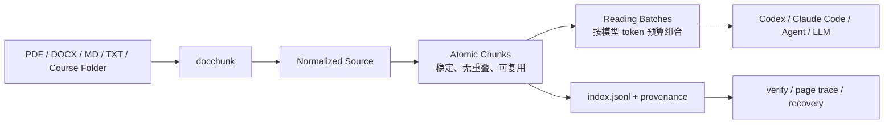

# docchunk

> **Make long documents reliably readable by AI agents.**  
> 面向 AI Agent 的无损、可验证、token-aware 长文档预处理层。

[](https://www.python.org/)
[](LICENSE)
[](#隐私与数据边界)

`docchunk` 把书籍、课程逐字稿、PDF、Word、Markdown 等长资料转换成 **可验证、可恢复、可追溯** 的阅读 Corpus，让 Codex、Claude Code、各类 Agent 或 LLM 能按受控窗口分批读完整份材料，而不是简单把全文“塞进上下文”。

> **Chunking is lossless. Distillation may be lossy.**  
> 对标准化后的正文，Atomic Chunk 可以重新拼接并由 `docchunk verify` 逐字符验证完整性。

## 30 秒看懂它解决什么问题

普通 chunker 通常围绕 RAG 检索设计：把文档切成许多小片段，方便 embedding 和召回。  
`docchunk` 解决的是另一个问题：**如何让一个 Agent 有计划地、完整地读完一本书、一整套课程或一份很长的工作资料，并且能够证明没有漏读、重复或篡改。**



## 为什么不是简单按字符切

- **沿自然语言边界切分**：优先标题 → 段落 → 句子 → 子句，而不是固定字符数硬切。
- **两级结构**：Atomic Chunk 约 6K tokens，稳定、无重叠；Reading Batch 约 24K tokens，按模型预算临时组合。
- **换模型不重做原文处理**：只需 `rebuild-batches` 调整阅读窗口，Atomic 文件保持不变。
- **全文覆盖可验证**：`verify` 检查缺口、重复、token 计数、Batch 覆盖、来源引用以及 PDF 页码存在性。
- **表格上下文保护**：超长表格跨片时携带表头提示，并明确标记为上下文，不污染正文。
- **来源可追溯**：PDF 逐页路由（v1.1），每页记录所用 parser 与原因（`page-routing.jsonl`）；每个 Atomic 可回查原 PDF 页码。
- **整个文件夹就是一个输入**：课程、访谈集、逐字稿目录可作为 Document Set 处理，文件自然排序并保留独立来源身份。
- **本地优先**：`docchunk` 本身不调用 LLM API，也不会主动上传文档。

## 和普通 Chunker 的区别

| 维度 | 常见 RAG Chunker | `docchunk` |
| --- | --- | --- |
| 主要目标 | 检索与召回 | Agent 完整阅读长资料 |
| 全文覆盖 | 通常不是核心保证 | `verify` 校验完整覆盖 |
| 原文完整性 | 通常不验证 | 对标准化正文逐字符重建验证 |
| Chunk 稳定性 | token 预算变化常需重切 | Atomic 稳定，Batch 可重建 |
| 上下文衔接 | 常用固定 overlap | 复叠完整 Atomic 作为 Context Bridge |
| 来源追溯 | 取决于实现 | `index.jsonl` + 文档身份 + PDF 页码 |
| 多文件课程 | 常需先自行拼接 | 原生 Document Set，保留每个文件来源 |
| Agent 工作流 | 需自行约定 | Reading Batch + `longdoc-router` |
| 隐私 | 取决于服务 | `docchunk` 本身本地处理、不调用 LLM API |

## 适合什么场景

如果你遇到下面任一情况，`docchunk` 就是为这种工作流准备的：

- 让 Codex / Claude Code / Agent **读完整本书**，再做总结、研究或知识蒸馏；
- 把几十到几百页 PDF 变成可逐批阅读、可回查页码的 Corpus；
- 把一整套课程逐字稿作为一个有顺序、有来源身份的输入；
- 先稳定地做“无损预处理”，再把材料交给 Cangjie / Nuwa / 自定义 Skill；
- 同一份长资料要适配不同上下文窗口的模型，又不想反复 OCR、转换和切片；
- 对“Agent 到底有没有读全”有审计式、可验证要求。

## 支持的输入

| 输入 | 默认处理方式 | 说明 |
| --- | --- | --- |
| `.txt` / `.md` | 直接标准化 | 无需额外解析器 |
| `.docx` | Pandoc → GFM Markdown | 可显式配置 MinerU fallback |
| `.pdf` | SmartPdfAdapter：pdf-inspector 逐页路由，native 页直接读、OCR 页走 MinerU | 逐页审计证据 `page-routing.jsonl` |
| 文件夹 | Document Set | 自然排序，独立 document_id，不粗暴拼接来源 |

## 安装

当前版本从 GitHub 安装。需要 **Python 3.12** 与 [`uv`](https://docs.astral.sh/uv/)。

```bash
git clone https://github.com/hg199074jin/docchunk.git
cd docchunk
uv sync
uv run docchunk doctor
```

外部工具按输入类型选择安装：

- **Pandoc**：处理 DOCX，例如 macOS：`brew install pandoc`
- **MinerU**：处理 PDF，参见 [MinerU 官方仓库](https://github.com/opendatalab/MinerU)

`doctor` 会检查 Python、pdf-inspector、Pandoc、MinerU、tiktoken 词表和 Corpus 根目录，并显示实际解析到的外部工具路径。

## 快速上手

### 1. 先用 TXT / Markdown 跑通

```bash
echo "第一段。第二段。第三段。" > demo.txt
uv run docchunk split demo.txt
```

命令会返回 Corpus 路径，例如：

```text
/Volumes/ORICO/LongDocCorpus/demo-3f786850e387
```

然后检查状态和完整性：

```bash
uv run docchunk status "/实际输出的Corpus路径"
uv run docchunk verify "/实际输出的Corpus路径"
```

成功时 `verify` 返回 PASS 语义并退出 0。

### 2. 处理 PDF（Smart PDF Routing，v1.1）

```bash
uv run docchunk doctor
uv run docchunk inspect "$HOME/Documents/audit-report.pdf"
uv run docchunk split "$HOME/Documents/book.pdf"
```

PDF 的唯一入口是 `SmartPdfAdapter`，逐页选择最可靠的解析器（v1.1 新增）：

```text
Native PDF page（可可靠直接读取）→ pdf-inspector 原生提取（不 OCR）
OCR-required PDF page（扫描/无法可靠读取）→ MinerU 单页解析（--start N --end N）
Mixed PDF → 按原始页码重新合并，页码 provenance 全程保留
纯扫描 PDF（所有页都需 OCR）→ 整份一次 MinerU 调用（方案 A）
pdf-inspector 自带 OCR → 不使用
confidence → 只记录诊断，绝不参与路由阈值
```

典型例子：100 页审计报告，1–3 页签章扫描、4–100 页原生电子文字 → 1–3 页走 MinerU OCR，4–100 页直接读原生文字，页码 1–100 连续可追溯。

`inspect` 会预演路由（不调用 MinerU）：显示哪些页走 native、哪些页走 OCR（OCR 页压缩为 `1-3` 这样的范围）以及 `route policy: page_smart_v1`。

每个 PDF Document 额外产出逐页审计证据 `source/documents/D0001/page-routing.jsonl`（每页恰好一行：该页用了哪个 parser、原因、页码）。MinerU 单页解析的页码由 DocChunk 强制回写为原 PDF 页码，绝不信任外部工具自己的页号。原始 PDF 永远只读。本地 MinerU 默认参数为 `-b hybrid-engine --effort medium`。

### 3. 处理 Word

```bash
uv run docchunk split "$HOME/Documents/report.docx"
```

DOCX 默认由 Pandoc 转为 GFM Markdown。只有显式开启 `docx_fallback_to_mineru` 时才会在 Pandoc 失败后降级，并把降级记录写入 Manifest。

### 4. 处理整个课程目录

```bash
uv run docchunk split "$HOME/Documents/课程"
```

例如：

```text
课程/
├── 1-第一课.md
├── 2-第二课.md
└── 10-第十课.md
```

`docchunk` 会按自然顺序 `1 → 2 → 10` 处理为一个 Document Set，同时保留每个文件自己的 `document_id` 和来源身份。

## 输出是什么

```text
<corpus-root>/<corpus-id>/
├── manifest.json        # 权威元数据：策略、指纹、验证状态
├── index.jsonl          # Atomic 索引：token、字符区间、标题路径、页码
├── state.json           # 处理状态机
├── combined.md          # 派生阅读视图
├── source/              # normalized 原文、blocks、source-ref（PDF 另有 page-routing.jsonl）
├── atomic/Axxxxxx.md    # 稳定的最小阅读单元
└── batches/Bxxxx.md     # Agent 实际读取的窗口
```

### Atomic Chunk

Atomic 是稳定的基础层：约 6K tokens、无重叠、可复用。它的目标不是直接适配某个具体模型，而是成为可验证、可长期复用的文档事实层。

### Reading Batch

Batch 是消费层：把多个 Atomic 按模型 token 预算组合成阅读窗口。相邻 Batch 可复叠一个完整 Atomic 作为 Context Bridge，并在 frontmatter 中区分：

- `overlap_atomic_ids`：只用于上下文衔接；
- `new_atomic_ids`：本 Batch 首次出现的新材料。

因此可以验证“新材料恰好覆盖全部 Atomic 一次”。

## `verify`：证明没有漏

```bash
uv run docchunk verify <corpus-path>
```

校验包括：

1. 按文档重建标准化正文并逐字符比对；
2. Atomic 字符区间无缺口、无重复；
3. token 数与索引一致；
4. Batch 的新材料完整覆盖所有 Atomic；
5. overlap 策略符合配置；
6. source hash / source-ref 与 Manifest 一致；
7. PDF 场景检查页码来源存在性。

`docchunk split` 完成后会自动运行 verify；失败时退出 1。

## 换模型：只重建 Batch

```bash
uv run docchunk rebuild-batches <corpus-path> \
  --target-tokens 32000 \
  --soft-min-tokens 20000 \
  --soft-max-tokens 40000 \
  --overlap-atomic-count 1
```

这一步只改变模型阅读窗口，不重新 OCR、不重新标准化、不重新切 Atomic。Atomic 文件哈希保持不变。

## 怎么交给 Codex / Claude Code / Agent

最简单的方式，是把下面这段直接交给你的 Agent：

```text
请按 B0001、B0002……的顺序阅读这个 Corpus 的 batches 目录：
<corpus-path>/batches/

每个 Batch 的 frontmatter 中：
- overlap_atomic_ids 是上下文桥，不算新材料；
- new_atomic_ids 是本批首次阅读的新材料。

需要核查原始来源时读取 index.jsonl。
请在完成全部 Batch 后再给出跨文档总结。
```

## 和 Cangjie / Nuwa 等 Skill 串联

仓库包含 `skills/longdoc-router/SKILL.md`。安装为 Agent Skill 后，可以让它负责：

```text
校验 Corpus → 按 Batch 调度 → 维护断点 → 调用下游 Skill
```

例如：

```text
请用 longdoc-router 处理这个 Corpus：<corpus-path>
这是课程逐字稿，目标是调用 cangjie-skill 蒸馏。
完成后再交给我的个人知识沉淀 Skill。
```

Router 不修改第三方 Skill，只在上游负责长文档读取编排。

## 常见问题

| 症状 | 常见原因 | 处理方式 |
| --- | --- | --- |
| `Pandoc executable was not found` | Pandoc 未安装或 PATH 不对 | `brew install pandoc` 后重新 `doctor` |
| `MinerU executable was not found` | MinerU 不在 PATH 且 venv 回退失败 | `uv run docchunk doctor`；或配置绝对路径 |
| `verify` 报 missing atomic | Corpus 被移动、删除或人为修改 | 保留原 Corpus，修复后 verify；必要时重新 `split --force` |
| forced split 很多 | OCR 无标点、超大表格等 | 检查 MinerU 输出；结合 `docchunk inspect` warning |
| 第二次 split 没重新 OCR | source hash 未变化，幂等复用 | 如确需重跑，使用 `--force` |
| 24K 想改 32K | 只是模型预算变化 | 运行 `rebuild-batches`，无需重新切 Atomic |

## 隐私与数据边界

- `docchunk` **本身不调用任何 LLM API**；
- 原始文件不会被修改；
- 所有产物写入本地 Corpus 目录；
- Pandoc、tiktoken 和本地 MinerU 均在本机工作；
- 如果你的 MinerU 自己配置了云端后端，那属于 MinerU 环境配置，`docchunk` 不会替你启用。

## 项目状态

当前版本：**v1.1.0**（Page-Level Smart PDF Routing）。

下一阶段重点不是堆更多“智能”，而是继续提高可安装性、可观测性和生态集成：

- [ ] 发布 PyPI / 简化一键安装
- [ ] 增加可复制的公开 Demo Corpus
- [ ] 增加更多真实长文档基准与回归样例
- [ ] 补充 Codex / Claude Code / Agent 集成示例
- [ ] 收集更多不同 PDF、课程和表格场景的 Issue

## 参与项目

如果你正在做长文档 Agent、知识蒸馏、课程处理、RAG 前处理或 PDF 工作流，欢迎：

- ⭐ Star：如果这个方向对你有用；
- 🐛 Issue：尤其欢迎真实长文档失败样例和边界情况；
- 🔧 PR：修复解析、验证、兼容性或文档问题；
- 🔌 Integration：把 `docchunk` 接入你的 Agent / Skill / Workflow。

详见 [CONTRIBUTING.md](CONTRIBUTING.md)。

## 发布与传播资料

如果你想介绍、评测或集成 `docchunk`，仓库里准备了 [Launch Kit](docs/launch-kit.md)，包含项目定位、Demo 脚本、社区发布文案和集成说明。

## 设计文档

- [设计稿](docs/superpowers/specs/2026-08-29-docchunk-longdoc-router-design.md)
- [实施计划](docs/superpowers/plans/2026-08-29-docchunk-longdoc-router-v1.md)

## License

[MIT](LICENSE)
